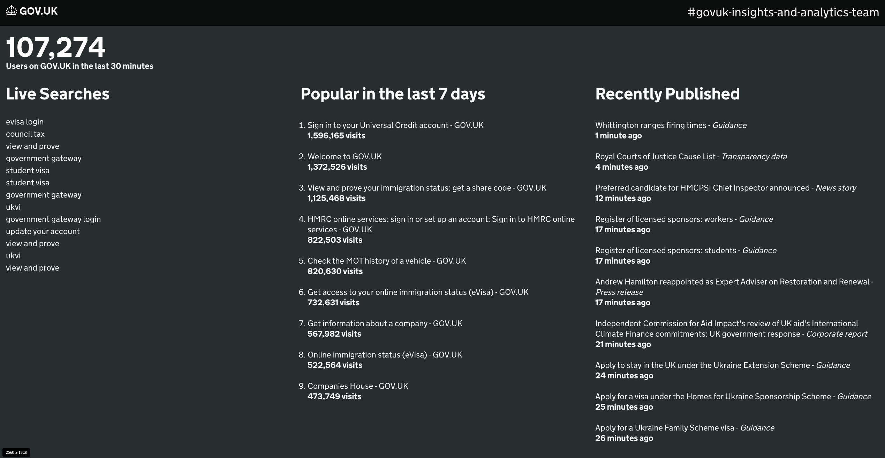

# GOV.UK Display Screen

** ⚠️ This project was archived on 12th July 2024 due to it having been broken for a number of months and due to the Universal Analytics data source being retired**

Screen to display live data from GOV.UK. It displays the number of GOV.UK users in last 30 mins, columns displaying the most recent searches on GOV.UK, the most popular pages and recently published content. Please note, the dashboard is intended as an internal tool only. 



http://govuk-display-screen.herokuapp.com/

## Running locally

To run the server you will need to set up some `ENV` variables. 

We are using the [dotenv gem][1] to load environment variables from a .env file into ENV in development. You will need to create
a .env file, add it into .gitignore, and then add in the keys for the env vars which can be acquired from the 2nd line Heroku account.
You can access this account by using the 2nd line credentials held in [govuk-secrets][2].

Once you have them, you should be able to start the server by running:

```
ruby ./server.rb
```

You can now navigate to the dashboard in your browser: http://localhost:4567/.

[1]: https://github.com/bkeepers/dotenv
[2]: https://github.com/alphagov/govuk-secrets/tree/main/pass#usage
[3]: https://github.com/alphagov/performanceplatform-collector
[4]: https://github.com/googleapis/google-cloud-ruby/tree/main/google-analytics-data-v1beta

## Where is the data coming from?

In the past, the dashboard made use of the [performance platform service][3] for its data. This serivce is now defunct, so we have moved to use the GA4 Ruby [client][4] instead. This client allows us to access the number of active users and most popular content.

## Custom search result pages

/corona and /brexit pages previously displayed live search results that matched coronavirus and brexit related terms.
They were removed due to lack of use. [Use this PR](https://github.com/alphagov/govuk-display-screen/pull/74)
as an example if bespoke search result pages need to be created in future.

# Licence

Copyright (C) 2013 Edd Sowden

Permission is hereby granted, free of charge, to any person obtaining a copy of
this software and associated documentation files (the "Software"), to deal in
the Software without restriction, including without limitation the rights to
use, copy, modify, merge, publish, distribute, sublicense, and/or sell copies
of the Software, and to permit persons to whom the Software is furnished to do
so, subject to the following conditions:

The above copyright notice and this permission notice shall be included in all
copies or substantial portions of the Software.

THE SOFTWARE IS PROVIDED "AS IS", WITHOUT WARRANTY OF ANY KIND, EXPRESS OR
IMPLIED, INCLUDING BUT NOT LIMITED TO THE WARRANTIES OF MERCHANTABILITY,
FITNESS FOR A PARTICULAR PURPOSE AND NONINFRINGEMENT. IN NO EVENT SHALL THE
AUTHORS OR COPYRIGHT HOLDERS BE LIABLE FOR ANY CLAIM, DAMAGES OR OTHER
LIABILITY, WHETHER IN AN ACTION OF CONTRACT, TORT OR OTHERWISE, ARISING FROM,
OUT OF OR IN CONNECTION WITH THE SOFTWARE OR THE USE OR OTHER DEALINGS IN THE
SOFTWARE.
